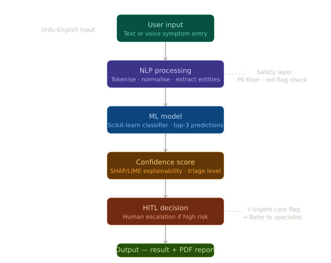

# 🧠 AI-Powered Smart Health Assistant

**Safety-Aware Clinical Triage System with Human-in-the-Loop Architecture**

---

## 🚀 Overview

This project is an AI-powered health triage system designed to classify user-reported symptoms into severity levels while prioritizing **safety, interpretability, and responsible AI design**.

Unlike traditional classifiers focused only on accuracy, this system is built for **real-world healthcare constraints**, where incorrect predictions can carry serious risk.

---

## 🎯 Problem Statement

In low-resource environments, access to immediate medical guidance is limited. However, deploying AI in healthcare introduces critical challenges:

* Risk of **misclassification in high-stakes scenarios**
* Lack of **human oversight in automated decisions**
* Bias in datasets, especially for **underrepresented populations**
* Difficulty handling **multilingual inputs (Urdu-English mix)**

This project addresses these challenges by designing a **safety-first AI system**, not just a predictive model.

---

## 🏗️ System Architecture

The system integrates NLP processing, classification, and a Human-in-the-Loop safety layer to ensure reliable decision-making in high-risk scenarios.

**Core Components:**

* NLP Pipeline for symptom extraction (Urdu-English support)
* Triage Classification Model (3 severity levels)
* Confidence Scoring Mechanism
* Human-in-the-Loop (HITL) Safety Layer
---

## ⚙️ Technical Stack

* **Languages:** Python
* **Frameworks:** FastAPI
* **Libraries:** Scikit-Learn, NLTK, Pandas, NumPy
* **Concepts:** NLP, Classification, Confidence Calibration, Responsible AI

---

## 📊 Key Results

* ✅ **84%+ accuracy** across 3 severity levels
* ✅ Handles **Urdu-English mixed inputs**
* ✅ Implements **Human-in-the-Loop intervention** for high-risk predictions
* ✅ Designed with **safety constraints from the initial architecture stage**

---
## 📊 Sample Predictions

View real input/output examples here:  
👉 [Sample Outputs](sample_outputs/input_output_examples.md)

### Example

**Input:** "Mujhe chest pain ho raha hai"  
**Output:** High Severity (Confidence: 0.82)  
**Action:** Human escalation required
---

## 🧠 Responsible AI Design

This system is built with responsibility as a **core constraint**, not an afterthought.

Key design decisions:

* ❗ **No diagnosis policy** — system only classifies severity, not medical conclusions
* 👤 **Mandatory human escalation** for high-risk cases
* 📉 **Confidence-based filtering** for uncertain predictions
* ⚖️ Consideration of **bias in medical AI systems**

---

## 🔬 Research & Documentation

This project is supported by a multi-part research series covering:

* Bias in medical AI
* Confidence calibration
* Human-in-the-loop system design
* Ethical considerations in healthcare AI

📎 *(Link to your blog / research posts here)*

---

## 🌍 Real-World Impact

This system is designed for:

* Low-resource healthcare environments
* Users with limited access to immediate medical consultation
* Multilingual populations (especially Urdu-English speakers)

It aligns with the broader goal of building **accessible and responsible AI systems** for underserved communities.

---

## ⚠️ Code Availability

The full implementation of this project is currently **private due to ongoing development**.

However, I am happy to provide:

* Code walkthroughs
* Technical discussions
* Architecture deep-dives

📩 *Available upon request*

---

## 👩‍💻 Author

**Kainat Nadeem**
AI for Social Impact · Responsible AI Systems · Women in STEM

---

## 🔗 Links

* Portfolio: *https://kainatnadeem.vercel.app*
* GitHub: *https://github.com/KainatNadeemCodes*
* LinkedIn: *https://www.linkedin.com/in/kainat-nadeem-a9408b324/*

---
